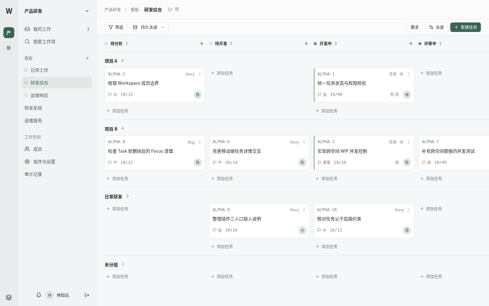

# Work · 工作管理平台

面向团队的工作管理平台，将多工作空间、看板协作与个人 WIP（在制任务）管理放在同一个工作台中。使用飞书账号登录，数据存储在 Supabase PostgreSQL，支持研发与运维场景扩展。

**本地开发只需 Node.js、pnpm，以及少量飞书 / Supabase 配置。** `pnpm dev` 会检查配置、应用数据库迁移，并同时启动前后端。

[快速开始](#快速开始) · [环境变量](#环境变量) · [开发与测试](#开发与测试) · [项目结构](#项目结构) · [部署说明](docs/deployment.md)



## 核心功能

- **团队协作**：多工作空间、看板、状态、泳道、任务类型、里程碑、标签、评论、资源与活动记录。
- **任务组织**：三层父子任务、单一负责人、多个参与人，以及按分组与参与人筛选的看板视图。
- **个人工作管理**：跨工作空间的 My Work、全局 WIP 上限、Focus / Unfocus，以及达到上限后的任务替换。
- **访问控制**：工作空间与看板角色、受限看板、账号停用、成员撤权、审计与最后一位有效 Owner 保护。
- **场景扩展**：研发插件提供 System / Module；运维插件提供 Service / Severity 与事件属性，支持按工作空间启停。
- **交互体验**：任务快捷预览与完整详情、搜索、通知、Intake、移动端布局与长列表虚拟化。

技术栈：TypeScript、React 19、Vite、TanStack Router / Query、Fastify、PostgreSQL、pnpm workspace。认证由服务端飞书 OAuth 与 HttpOnly Session Cookie 提供；浏览器仅访问同源 API。

## 快速开始

### 1. 准备开发环境

- Node.js **22.13+**（推荐 24 LTS）。
- pnpm **11.19.0**，与 `packageManager` 及锁文件保持一致。
- 一个用于开发的 [Supabase 项目](https://supabase.com/dashboard)。
- 一个可用的 [飞书企业自建应用](https://open.feishu.cn/app)。

在仓库根目录执行：

```bash
pnpm install --frozen-lockfile
pnpm setup
```

`pnpm setup` 创建根目录 `.env` 并生成随机 Session 密钥。重复执行会保留已有配置；缺少密钥时会自动补齐。

### 2. 填写飞书与 Supabase 配置

编辑 `.env`，必填下面 **3 项**。首次使用再填写管理员 open_id，即可登录后创建工作空间。

```dotenv
SUPABASE_DB_URL=你的 Supabase PostgreSQL 连接串
FEISHU_APP_ID=cli_你的应用 ID
FEISHU_APP_SECRET=你的应用密钥
BOOTSTRAP_PLATFORM_ADMIN_FEISHU_ID=ou_管理员的 open_id
```

**Supabase**：进入项目的 **Connect** 页面，复制 **Direct connection** 或 **Session pooler** 的 PostgreSQL URI，并替换数据库密码。本机没有 IPv6 时优先使用 **Session pooler（5432）**。密码中的 `@`、`#`、`%` 等字符需要 URL 编码。按 Supabase 提供的 CA 配置 TLS 验证，例如使用 `sslmode=verify-full`；需要自定义 CA 时可通过连接串的 `sslrootcert` 指定证书文件。不要使用 Transaction pooler（6543），迁移依赖会话级锁。

项目通过服务端 `pg` 驱动直接连接数据库，**不需要配置 Supabase URL、anon key、service role key 或 Supabase Auth**。使用有建表、函数与扩展权限的数据库账号；启动会把仓库迁移应用到目标项目，请使用独立开发项目。

**飞书**：在企业自建应用中启用网页登录能力，配置下列 OAuth 重定向地址，授权获取登录用户信息，并确保应用已发布且当前账号在可用范围内：

```text
http://localhost:5173/auth/feishu/callback
```

管理员变量使用**当前飞书应用下的 open_id**，不是 user_id 或 union_id。可以通过飞书 API 调试工具获取。若尚未取得，先登录，再在 Supabase SQL Editor 查询：

```sql
select feishu_open_id, display_name from public.app_user;
```

将自己的 open_id 填入 `.env`，重启 `pnpm dev` 并重新登录即可获得管理员身份。已引导的管理员不会因移除变量而被降权。

### 3. 启动调试

```bash
pnpm dev
```

打开 **http://localhost:5173**，选择“使用飞书登录”。管理员可在“工作空间”页面创建空间与看板，开始添加任务。

启动会自动检查必要配置并执行尚未应用的迁移，然后在同一终端启动 API 与 Web。数据库不通或迁移失败时会停止启动并显示错误。再次启动会跳过已执行的迁移，**不会重置数据库或导入演示用户**。按 `Ctrl+C` 停止服务；修改 `.env` 后重新启动。

## 环境变量

配置统一放在仓库根目录 `.env`；系统环境变量优先。可用 `ENV_FILE` 指定其他文件，相对路径按仓库根目录解析。

| 变量                                 | 必填         | 用途 / 默认值                                                                  |
| ------------------------------------ | ------------ | ------------------------------------------------------------------------------ |
| `SUPABASE_DB_URL`                    | 是           | 服务端 PostgreSQL 连接串，使用 Direct / Session pooler                         |
| `FEISHU_APP_ID`                      | 是           | 飞书企业自建应用 App ID                                                        |
| `FEISHU_APP_SECRET`                  | 是           | 飞书企业自建应用 App Secret                                                    |
| `BOOTSTRAP_PLATFORM_ADMIN_FEISHU_ID` | 首次使用建议 | 指定应用内管理员 open_id，登录时引导管理员身份                                 |
| `APP_SESSION_SECRET`                 | 自动生成     | `pnpm setup` / `pnpm dev` 生成并保存；生产须显式提供至少 32 字符的独立随机密钥 |
| `APP_BASE_URL`                       | 否           | 默认 `http://localhost:5173`，OAuth 回调与请求 Origin 的基准                   |
| `API_PORT`                           | 否           | 默认 `3001`，Web 开发代理自动跟随                                              |
| `NODE_ENV`                           | 否           | 默认 `development`，生产设为 `production`                                      |
| `SENTRY_DSN`                         | 否           | API 错误监控                                                                   |
| `VITE_SENTRY_DSN`                    | 否           | Web 错误监控                                                                   |
| `FEISHU_BASE_URL`                    | 否           | 仅隔离测试中使用模拟飞书，默认留空，生产禁止设置                               |

`.env` 已被 Git 忽略。数据库密码、飞书密钥与 Session 密钥只在服务端使用，不要为其添加 `VITE_` 前缀。

## 开发与测试

### 常用命令

| 命令                            | 作用                                    |
| ------------------------------- | --------------------------------------- |
| `pnpm setup`                    | 初始化本地配置与 Session 密钥           |
| `pnpm dev`                      | 配置检查 → 数据库迁移 → 启动前后端      |
| `pnpm dev:api` / `pnpm dev:web` | 单独启动 API / Web；自行先执行迁移      |
| `pnpm db:migrate`               | 仅执行待应用的迁移                      |
| `pnpm lint` / `pnpm typecheck`  | 代码规范与 TypeScript 检查              |
| `pnpm test:unit`                | 不依赖数据库的配置与任务队列测试        |
| `pnpm test` / `pnpm test:db`    | API 集成测试 / pgTAP 数据库约束测试     |
| `pnpm test:e2e`                 | Playwright 浏览器测试                   |
| `pnpm build`                    | 构建 Web 与 API                         |
| `pnpm check:secrets`            | 检查 Web 构建产物是否包含服务端密钥引用 |

### 隔离集成测试

日常开发直接使用飞书与 Supabase。完整集成测试使用 Fake Feishu、演示账号与**可丢弃的本机 PostgreSQL 15+ 数据库**，数据库还需安装 `pgTAP`。这套测试环境与日常调试分开配置：

```bash
cp tests/.env.example .env.test
# 将 .env.test 中的连接串改为自己的本机测试数据库
ENV_FILE=.env.test pnpm db:reset
ENV_FILE=.env.test pnpm test:db
ENV_FILE=.env.test pnpm test
pnpm exec playwright install --with-deps chromium
ENV_FILE=.env.test pnpm test:e2e
```

Windows PowerShell 使用 `$env:ENV_FILE=".env.test"`，再运行对应命令。Playwright 会自动启动 API、Web 与 Fake Feishu。GitHub Actions 使用原生 PostgreSQL 与 pgTAP，无需 Docker 配置。

`db:reset` 会删除并重建 `public` schema，E2E setup 也会执行 reset。`db:reset` 与 `db:seed` 仅允许回环地址，不能指向需要保留数据的数据库。Hosted Supabase 调试使用 `pnpm dev` 或 `pnpm db:migrate`。

截图基线使用 Linux Chromium；更换系统、字体或浏览器版本后需人工复核差异，再决定是否执行 `pnpm test:e2e --update-snapshots`。已有 Chromium 的环境可通过 `CHROMIUM_PATH` 指定可执行文件。

## 项目结构

```text
apps/
  api/                 Fastify API、飞书认证、Session、数据库访问与插件装配
  web/                 React 工作台、路由、任务交互与插件界面
packages/
  shared/              共享类型、校验与错误码
  plugin-sdk/          插件接口与 Core 模板
  plugin-rnd/          研发插件
  plugin-ops/          运维插件
supabase/
  migrations/          按文件顺序执行的 SQL 迁移
  tests/               pgTAP 数据库测试
  seed.sql             隔离测试演示数据
scripts/               本地初始化、启动、迁移、构建与校验
tests/                单元、API 集成与 Playwright 测试
docs/                 部署、设计决策与验证记录
```

## 常见问题

- **启动提示缺少变量**：运行 `pnpm setup`，填写根目录 `.env` 的 3 项必填配置；不要把服务端配置放在 `apps/web/.env`。
- **Supabase 连接失败**：检查密码、特殊字符编码、项目运行状态与 TLS 证书；Direct connection 的 IPv6 不可达时改用 Session pooler 的 5432 端口。
- **迁移找不到数据库扩展函数**：连接统一使用 `search_path=public,extensions`，兼容 Supabase 已安装到 `extensions` schema 的扩展；确认数据库账号拥有建表与创建扩展权限。
- **飞书回调失败**：核对应用发布状态、用户范围、登录用户信息权限，以及回调白名单是否与启动输出完全一致。`localhost` 与 `127.0.0.1` 不能混用。
- **登录后看不到工作空间**：新数据库没有演示数据。配置管理员 open_id 后重新登录，由管理员创建空间或邀请成员。
- **5173 端口占用**：停止占用进程，或设置 `APP_BASE_URL=http://localhost:5180` 并同步更新飞书回调白名单。开发服务器启用严格端口检查，避免悄悄换端口导致登录失败。

## 部署与贡献

生产构建、数据库权限、TLS 与 HTTPS 反向代理说明见 [部署文档](docs/deployment.md)。本地 Session 密钥不要直接复用于生产。

提交改动前建议运行 `pnpm lint`、`pnpm typecheck` 与相关测试；新增数据库行为请添加新的迁移文件，不要修改已应用的迁移。插件接口与权限约束的背景见 [实施决策](docs/decisions.md)。

现有验证记录见 [验证文档](docs/verification.md)。真实飞书与 Hosted Supabase 的端到端联调需要目标应用和数据库凭据；历史本地测试结果不代表外部服务已验证。
